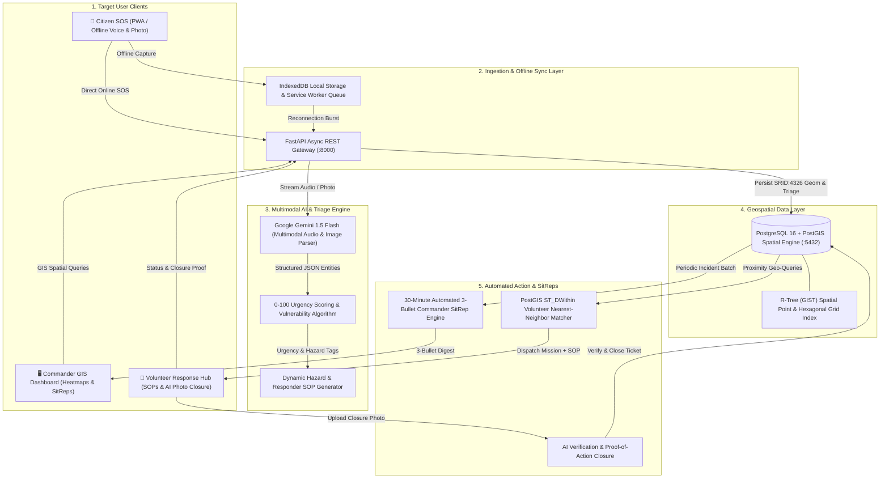
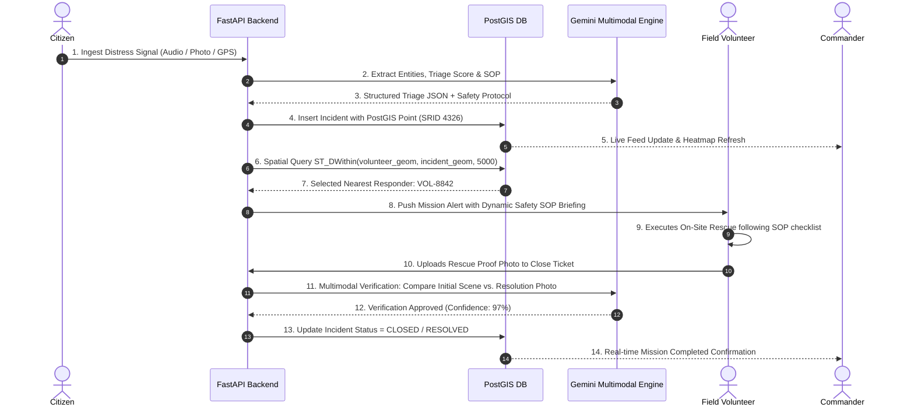

# SOTERIA — System Data Flow & Architecture Diagrams

This document details the high-level request lifecycle, AI extraction pipelines, geospatial processing, and offline synchronization mechanisms powering the SOTERIA platform.

---

## 1. High-Level System Architecture Overview



---

## 2. End-to-End Multimodal SOS Ingestion & AI Triage Flow

```
[Victim in Disaster Zone]
       │
       ▼ (Sends frantic voice note in dialect or snaps photo)
[Citizen PWA Interface]
       │
       ├──[Network Offline?] ──► [IndexedDB Local Encrypted Queue]
       │                                     │
       │                                     ▼ (Network signal returns)
       └──[Network Online]  ─────────────────┘
                    │
                    ▼ HTTP POST /api/v1/incidents/
[FastAPI Ingestion Endpoint (Async Worker)]
       │
       ├──► [GeoAlchemy2: Convert GPS to ST_SetSRID(ST_MakePoint(lng, lat), 4326)]
       │
       ├──► [Stream Payload to Google Gemini Multimodal API]
       │            │
       │            ▼
       │      [Structured JSON Extraction]
       │      • Trapped Persons Count: 3
       │      • Vulnerable: Elderly (2), Infant (1)
       │      • Hazard: Rapid Flood + Transformer Arcing
       │      • Medical: Hypothermia & Trauma
       │
       ├──► [Compute 0-100 Triage Composite Score]
       │      Score = Base(30) + Trapped(20) + Vulnerable(20) + Hazard(20) = 90.0 (CRITICAL_P1)
       │
       ├──► [Synthesize Dynamic Volunteer Safety SOP]
       │      • Gear: Inflatable Boat, High-Voltage Insulated Boots, Infant PFD
       │      • Protocol: De-energize transformer -> Approach upstream -> Evacuate infant first
       │
       ▼
[Persist Incident in PostGIS Database]
       │
       ├──► [Trigger Real-Time Webhook to GIS Dashboard (Mapbox Heatmap)]
       └──► [Trigger Proximity Match: Find nearest qualified responders within 5km]
```

---

## 3. PostGIS Hexagonal Risk Density & Spatial Clustering

```
                       [Incoming Incident Points (SRID:4326)]
                                       │
                                       ▼
    ┌────────────────────────────────────────────────────────────────────────┐
    │ PostGIS Spatial Binning Query:                                         │
    │ SELECT ST_HexagonGrid(500, ST_SetSRID(ST_EstimatedExtent(...), 4326)) │
    │ JOIN incidents ON ST_Intersects(geom, hex_geom)                        │
    │ GROUP BY hex_geom                                                      │
    │ CALCULATE: AVG(triage_score) * COUNT(incidents) = Risk Intensity       │
    └────────────────────────────────────────────────────────────────────────┘
                                       │
                                       ▼
                       [Real-Time Commander Heatmap]
          ╔══════════════╦══════════════╦══════════════╗
          ║  HEX-01: P4  ║  HEX-02: P1  ║  HEX-03: P2  ║
          ║  Low (12.0)  ║ Critical(94) ║ Urgent (71)  ║
          ╚══════════════╩══════════════╩══════════════╝
```

---

## 4. Volunteer Dispatch, Dynamic SOP & Closed-Loop Verification



---

## 5. Automated 30-Minute SitRep Generation Lifecycle

```
[System Clock Trigger (Every 30 Minutes)]
                  │
                  ▼
[Query PostGIS: Incidents Ingested in Last 30 mins]
• Total Ingested: 142
• P1 Critical: 18 | Resolved: 12 | In Progress: 6
• Active Hazard Hotspot: Prayagraj North Ghat (Hex-02)
                  │
                  ▼
[Submit Batch Metrics to Gemini Generative Model]
                  │
                  ▼
[Generate Structured 3-Bullet Situation Report (SitRep)]
  • 1. Hotspot Status: 18 P1 flood rescues logged in Sector 3; 12 resolved by Boat Teams.
  • 2. Bottlenecks: Electrical transformer hazard cleared in Sector 4; 6 P1 pending boat evacuation.
  • 3. Priority Action: Redeploy 4 watercraft teams to North Bridge before river crests at 20:00.
                  │
                  ▼
[Broadcast SitRep to Emergency Commanders via Webhook & Dashboard]
```
