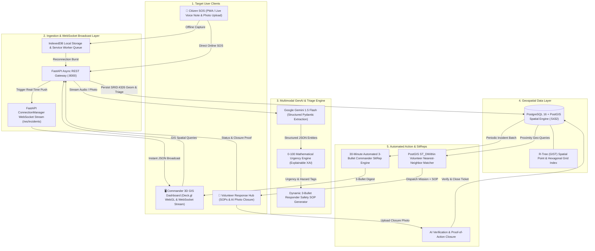
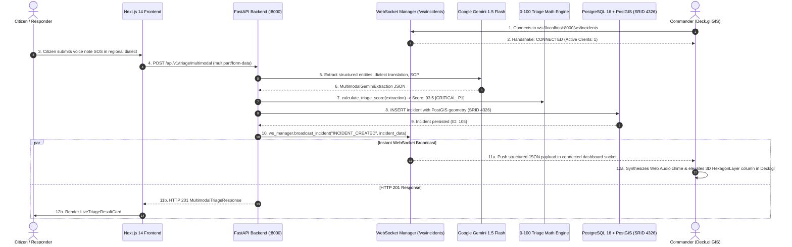

# SOTERIA — System Data Flow & Architecture Diagrams

This document details the high-level request lifecycle, AI extraction pipelines, geospatial processing, and offline synchronization mechanisms powering the SOTERIA platform.

---

## 1. High-Level System Architecture Overview



---

## 2. Milestone 3: Real-Time WebSocket & Deck.gl 3D GIS Lifecycle



---

## 3. Explainable 0-100 Urgency Triage Math Formula

```
┌────────────────────────────────────────────────────────────────────────────────────────┐
│                              SOTERIA URGENCY TRIAGE FORMULA                            │
│                                                                                        │
│   Final Score = clamp(0, 100, H_sev + T_rap + V_uln + M_ed + R_ec)                     │
├──────────────────────────┬───────────┬─────────────────────────────────────────────────┤
│ Factor                   │ Max Pts   │ Mathematical Formula / Criteria                 │
├──────────────────────────┼───────────┼─────────────────────────────────────────────────┤
│ Hazard Severity (H_sev)  │ 35.0 pts  │ hazard_severity (1-10) * 3.5                    │
│ Trapped Factor (T_rap)   │ 25.0 pts  │ If trapped: 15.0 + min(10.0, trapped_count*2.5) │
│ Vulnerability (V_uln)    │ 25.0 pts  │ min(25.0, 3.0*eld + 3.5*chd + 4.0*preg + 4*dis) │
│ Medical Trauma (M_ed)    │ 10.0 pts  │ min(10.0, len(injuries_reported) * 3.5)         │
│ Recency Freshness (R_ec) │  5.0 pts  │ Fresh (<=15m): 5.0 | Older: max(0, 5 - dt/30)   │
└──────────────────────────┴───────────┴─────────────────────────────────────────────────┘
                                    │
                                    ▼
       ┌────────────────────┬────────────────────┬────────────────────┐
       │ CRITICAL_P1 (>=80) │  URGENT_P2 (60-79) │ MODERATE_P3 (40-59)│
       │ Life Threat (<10m) │ Rescue Queue (<30m)│ Sustenance (<2h)   │
       └────────────────────┴────────────────────┴────────────────────┘
```

---

## 4. Deck.gl 3D Hexagonal Aggregation Layering

```
                     [Incoming Real-Time Coordinates (SRID:4326)]
                                          │
                                          ▼
     ┌─────────────────────────────────────────────────────────────────────────┐
     │ Deck.gl HexagonLayer:                                                   │
     │ Radius: 500m | Extruded: True | ElevationScale: 15 | Coverage: 0.9      │
     │ Aggregates incident counts & composite triage scores into 3D columns    │
     │ Color Range: Emerald (#10B981) -> Amber (#F59E0B) -> Red (#EF4444)      │
     └─────────────────────────────────────────────────────────────────────────┘
                                          │
                                          ▼
                     [Deck.gl WebGL Canvas + CartoDB Dark Matter]
           ╔══════════════╦══════════════╦══════════════╗
           ║  HEX-01: P4  ║  HEX-02: P1  ║  HEX-03: P2  ║
           ║  Low (12.0)  ║ Critical(94) ║ Urgent (71)  ║
           ║  Flat 2D     ║ 3D Extruded  ║ Mid Elevation║
           ╚══════════════╩══════════════╩══════════════╝
```

---

## 5. Automated 30-Minute SitRep Generation Lifecycle

```
[System Clock Trigger (Every 30 Minutes)]
                  │
                  ▼
[Query PostGIS: Incidents Ingested in Last 30 mins]
• Total Ingested: 142
• P1 Critical: 18 | Resolved: 12 | In Progress: 6
• Active Hazard Hotspot: Prayagraj North Ghat (Hex-02)
                  │
                  ▼
[Submit Batch Metrics to Gemini Generative Model]
                  │
                  ▼
[Generate Structured 3-Bullet Situation Report (SitRep)]
  • 1. Hotspot Status: 18 P1 flood rescues logged in Sector 3; 12 resolved by Boat Teams.
  • 2. Bottlenecks: Electrical transformer hazard cleared in Sector 4; 6 P1 pending boat evacuation.
  • 3. Priority Action: Redeploy 4 watercraft teams to North Bridge before river crests at 20:00.
                  │
                  ▼
[Broadcast SitRep to Emergency Commanders via Webhook & Dashboard]
```
