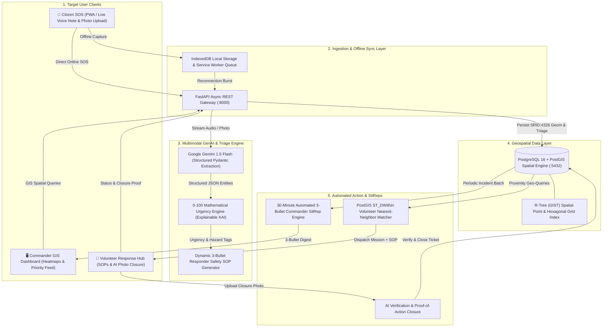

# SOTERIA — System Data Flow & Architecture Diagrams

This document details the high-level request lifecycle, AI extraction pipelines, geospatial processing, and offline synchronization mechanisms powering the SOTERIA platform.

---

## 1. High-Level System Architecture Overview



---

## 2. Milestone 2: Multimodal SOS Ingestion & AI Triage Sequence

```mermaid
sequenceDiagram
    autonumber
    actor C as Citizen / First Responder
    participant NextJS as Next.js 14 Frontend
    participant API as FastAPI Backend (:8000)
    participant Storage as /uploads Local Media Storage
    participant Gemini as Google Gemini 1.5 Flash (google-genai)
    participant Engine as 0-100 Triage Math Engine
    participant DB as PostgreSQL 16 + PostGIS (SRID 4326)

    C->>NextJS: 1. Speaks in regional dialect (e.g., Hindi/Bhojpuri) + snaps scene photo
    NextJS->>API: 2. POST /api/v1/triage/multimodal (multipart/form-data)
    API->>Storage: 3. Persist voice_sos.webm and scene_photo.jpg
    alt Live Gemini API Key Configured
        API->>Gemini: 4a. Stream Audio/Photo buffer + prompt + response_schema
        Gemini-->>API: 5a. Structured JSON (Transcript, Translation, Hazard, Trapped, SOP)
    else Zero-Key / Network Fallback
        API->>API: 4b/5b. Heuristic Dialect Extractor & SOP Generator
    end
    API->>Engine: 6. calculate_triage_score(extraction, client_timestamp)
    Note over Engine: Score = H_sev(35) + T_rap(25) + V_uln(25) + M_ed(10) + R_ec(5)
    Engine-->>API: 7. TriageBreakdown (Score: 93.5, Tier: CRITICAL_P1)
    API->>DB: 8. INSERT into incidents (geom: SRID=4326;POINT(lng lat), score: 93.5)
    DB-->>API: 9. Incident record created (ID: 104)
    API-->>NextJS: 10. HTTP 201 MultimodalTriageResponse
    NextJS->>C: 11. Render LiveTriageResultCard & Live Feed in Commander View
```

---

## 3. Explainable 0-100 Urgency Triage Math Formula

```
┌────────────────────────────────────────────────────────────────────────────────────────┐
│                              SOTERIA URGENCY TRIAGE FORMULA                            │
│                                                                                        │
│   Final Score = clamp(0, 100, H_sev + T_rap + V_uln + M_ed + R_ec)                     │
├──────────────────────────┬───────────┬─────────────────────────────────────────────────┤
│ Factor                   │ Max Pts   │ Mathematical Formula / Criteria                 │
├──────────────────────────┼───────────┼─────────────────────────────────────────────────┤
│ Hazard Severity (H_sev)  │ 35.0 pts  │ hazard_severity (1-10) * 3.5                    │
│ Trapped Factor (T_rap)   │ 25.0 pts  │ If trapped: 15.0 + min(10.0, trapped_count*2.5) │
│ Vulnerability (V_uln)    │ 25.0 pts  │ min(25.0, 3.0*eld + 3.5*chd + 4.0*preg + 4*dis) │
│ Medical Trauma (M_ed)    │ 10.0 pts  │ min(10.0, len(injuries_reported) * 3.5)         │
│ Recency Freshness (R_ec) │  5.0 pts  │ Fresh (<=15m): 5.0 | Older: max(0, 5 - dt/30)   │
└──────────────────────────┴───────────┴─────────────────────────────────────────────────┘
                                    │
                                    ▼
       ┌────────────────────┬────────────────────┬────────────────────┐
       │ CRITICAL_P1 (>=80) │  URGENT_P2 (60-79) │ MODERATE_P3 (40-59)│
       │ Life Threat (<10m) │ Rescue Queue (<30m)│ Sustenance (<2h)   │
       └────────────────────┴────────────────────┴────────────────────┘
```

---

## 4. PostGIS Hexagonal Risk Density & Spatial Clustering

```
                       [Incoming Incident Points (SRID:4326)]
                                       │
                                       ▼
    ┌────────────────────────────────────────────────────────────────────────┐
    │ PostGIS Spatial Binning Query:                                         │
    │ SELECT ST_HexagonGrid(500, ST_SetSRID(ST_EstimatedExtent(...), 4326)) │
    │ JOIN incidents ON ST_Intersects(geom, hex_geom)                        │
    │ GROUP BY hex_geom                                                      │
    │ CALCULATE: AVG(triage_score) * COUNT(incidents) = Risk Intensity       │
    └────────────────────────────────────────────────────────────────────────┘
                                       │
                                       ▼
                       [Real-Time Commander Heatmap]
          ╔══════════════╦══════════════╦══════════════╗
          ║  HEX-01: P4  ║  HEX-02: P1  ║  HEX-03: P2  ║
          ║  Low (12.0)  ║ Critical(94) ║ Urgent (71)  ║
          ╚══════════════╩══════════════╩══════════════╝
```

---

## 5. Automated 30-Minute SitRep Generation Lifecycle

```
[System Clock Trigger (Every 30 Minutes)]
                  │
                  ▼
[Query PostGIS: Incidents Ingested in Last 30 mins]
• Total Ingested: 142
• P1 Critical: 18 | Resolved: 12 | In Progress: 6
• Active Hazard Hotspot: Prayagraj North Ghat (Hex-02)
                  │
                  ▼
[Submit Batch Metrics to Gemini Generative Model]
                  │
                  ▼
[Generate Structured 3-Bullet Situation Report (SitRep)]
  • 1. Hotspot Status: 18 P1 flood rescues logged in Sector 3; 12 resolved by Boat Teams.
  • 2. Bottlenecks: Electrical transformer hazard cleared in Sector 4; 6 P1 pending boat evacuation.
  • 3. Priority Action: Redeploy 4 watercraft teams to North Bridge before river crests at 20:00.
                  │
                  ▼
[Broadcast SitRep to Emergency Commanders via Webhook & Dashboard]
```
